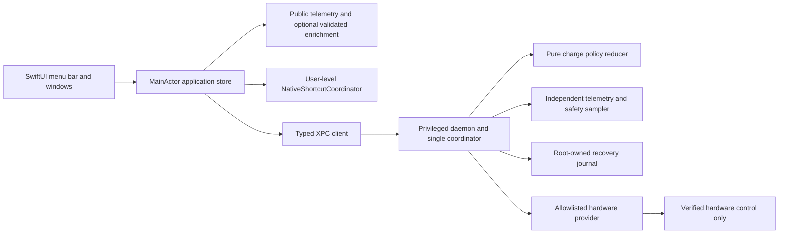

# Architecture proposal

Status: selected design; first read-only app, telemetry, local storage, domain reducer and control-contract seams implemented 2026-10-02. No hardware controller or privileged service is implemented or validated. See IMPLEMENTATION_STATUS.md. “macOS 27 compatible” is a release acceptance target, not an established property. Read [SPEC.md](SPEC.md), [platform research](research/MACOS_PLATFORM.md), and [API.md](API.md) together; this document owns component and lifecycle decisions.

## Evidence and design boundary

Apple documents public power-source snapshots and change notifications through IOPowerSources; these describe batteries and UPS devices and do not constitute a documented custom charging-control API. [Apple IOPowerSources](https://developer.apple.com/documentation/iokit/iopowersources_h)

Apple documents a “Set Battery Charge Limit” Shortcuts action in macOS 26.4 and documents running a shortcut through the `shortcuts` command. This supports investigating a user-level integration with Apple's limit policy. It does not prove the action exists or works on this machine, provide an unrestricted Swift charging setter, or establish custom discharge cutoffs. [Apple Shortcuts release notes](https://support.apple.com/en-gb/125148), [Apple Shortcuts CLI](https://support.apple.com/en-nz/guide/shortcuts-mac/apd455c82f02/mac)

Apple's `SMAppService` manages bundled helpers on macOS 13 and later, with registration subject to approval. Registration, approval, connection liveness, and actual hardware control are separate states. [Apple SMAppService](https://developer.apple.com/documentation/servicemanagement/smappservice)

The remaining architecture is a proposal. Hardware-specific SMC or IORegistry actuation is a research candidate behind an interface, never assumed available because the helper runs as root. macOS 27 reports can invalidate older techniques. A restriction on holding charging while preserving adapter power does not imply a restriction on adapter inhibition, or vice versa. Exact machine, OS build, firmware, provider version, and individual operation must pass a lab gate before the operation becomes available.

## Components

| Component | Responsibility | Boundary |
| --- | --- | --- |
| Native app | Menu bar, popover, history, settings, accessibility, approval guidance, notifications | Normal logged-in user; never root |
| TelemetryKit | Public IOPowerSources adapter; optional read-only registry enrichment with per-field provenance | UI monitoring continues without helper approval |
| Domain | DTOs, capability model, validation, deterministic policy reducer | Pure Swift; no UI, XPC, IOKit, filesystem, wall-clock dependency |
| NativeShortcutCoordinator | Candidate fixed trusted shortcut for Apple's supported native limit values | User-level process, separate delegated policy mode |
| ControlClient | Authentication requirements, negotiation, reconnect, command tracking | No UI declarations that execution succeeded before observation |
| ControlDaemon | Machine-wide owner, validated policy persistence, independent safety telemetry, serialized mutations | Only process allowed to use privileged provider |
| HardwareProvider | Probe, typed hold/adapter operations, readback, owned restoration | No arbitrary keys, buffers, scripts, paths, or subprocess API |
| HistoryStore | Local SQLite history and exports; coalesced writes, migrations, configurable retention | App user directory; hardware serial numbers excluded by default |

Use Swift, SwiftUI, Foundation, AppKit where needed, ServiceManagement, IOKit, and OSLog. Swift Charts is suitable for native plots. Start with native packages and targets inside one project; no network service, account, analytics, or kernel extension. Suggested targets: `StatBattApp`, `StatBattDomain`, `StatBattTelemetry`, `StatBattControlProtocol`, `StatBattControlDaemon`, and test support. Final bundle identifiers remain placeholders until naming/signing is settled.

The app is a menu-bar application, with an optional login item through `SMAppService.mainApp`. The privileged daemon is an optional bundled LaunchDaemon registered through `SMAppService.daemon(plistName:)`. The native delegated mode does not require that daemon.

## Three control modes

1. **Monitor only:** default on unknown or blocked hardware. UI shows metrics, missing-value reasons, and unsupported control explanations. No probing writes.
2. **Native delegated limit:** candidate Apple's fixed limit action. The app sets a supported limit and Apple owns enforcement. Resume thresholds, custom discharge, exact cutoff timing, and sleep enforcement are not claimed. The app cannot run its privileged policy at the same time.
3. **Verified custom policy:** helper owns a hardware policy using separately verified operations. `holdChargingPreservingAC` stops battery charging while leaving adapter supply available. `inhibitAdapter` requests battery-powered operation despite an attached adapter. The latter causes battery cycling; it is not bypass or equivalent to holding charging.

An opt-in adapter-cycling fallback can approximate a range when only inhibition works. It is off by default, requires a separate explicit consent record, and requires a gap of at least five percentage points. Its status must say “battery cycling; awake only” when that is the tested guarantee. Never silently substitute it for a hold-charge request. Provider capability changes suspend affected policy instead of selecting another backend.

When a helper is installed, mode arbitration is daemon-owned: `beginNativeDelegation` durably disables custom policy/overrides and records a native fence owned by the current controlling UID before restoration. It returns readiness only after owned custom controls are verified restored. The normal app then runs the fixed shortcut and records the outcome through `resolveNativeDelegation`. This fence survives UI disconnect, daemon restart, and reboot; it does not expire into renewed custom policy because Apple's setting can persist. Custom mutations and second-user takeover remain blocked while fenced. Leaving native mode requires the owner to restore/reconcile the native setting, with an observed result or explicit visible manual confirmation; only then can the daemon clear the fence and accept a separate custom-policy enable. Reconnect returns the same fence and pending outcome, not a new policy owner. If no helper exists, a user-session singleton coordinator can serialize the app's native requests, but it cannot claim machine-wide exclusion of another user or external controller.

Native delegation uses the bounded exact-target80% lab result and the implemented user-level coordinator. Other targets, cutoff, live app qualification and lifecycle remain pending. Mutable-workflow trust is explicitly approved in decision0002; complete content inspection is not claimed. Use `Process` with an absolute verified executable and fixed arguments, no shell, and no caller-selected shortcut name or file path. An exit code of zero means the shortcut ran successfully, not that battery behavior changed. Cancellation/timeout produces `outcomeUnknown` until observation resolves it. If a previous native limit cannot be read, require a visible user-confirmed return limit before first use and label its provenance; do not claim automatic restoration to an observed baseline. Native persistent limits must remain explicitly visible even while the app is closed. Do not offer expiring native overrides without a verified expiry/restoration mechanism.

## Policy engine

The helper, rather than the UI, owns the custom-policy loop. It reads the same public telemetry independently; UI-supplied state of charge or temperature is never trusted for actuation. A reducer takes validated config, capabilities, fresh telemetry, override, prior latch, and injected clocks, and returns a decision plus a reason. Effects are applied by one serialized coordinator. Sleep, clock, telemetry, adapter, and capability events use the same reducer.

Proposed custom defaults are resume at 70%, hold at 80%, and a 20% discharge reserve. Values use displayed/normalized state of charge; raw state of charge is a separately labeled metric. Custom configuration requires `10 <= resume < hold <= 100`, a minimum two-percentage-point gap, and `reserve >= 20`. Active discharge targets cannot be below reserve; adapter cycling additionally requires resume >= reserve. These defaults are product choices, not claims about Apple battery chemistry.

For true charge hold, `SOC >= hold` latches hold; `SOC <= resume` releases that owned hold; between thresholds the prior latch persists. On first enable or restart, use a fresh sample: start holding only at/above hold, otherwise permit the baseline/system policy until the upper boundary. A saved policy is not a saved hardware latch. A cold restart must not inherit a stale charging decision.

Manual overrides have an explicit goal and expiry (maximum 24 hours): allow charging until a target, hold charging, or discharge to a target. Reaching a target, losing adapter attachment during active discharge, expiry, sleep, insufficient telemetry, or a safety event ends active discharge. Charge-to-target releases only the app's hold; it does not force Apple's thermal or optimized-charging policy to charge. `Stop and return control` disables custom automation, cancels the override, and restores the app's owned changes. “Resume configured range” cancels only the override and re-evaluates policy.

Safety has precedence over overrides and thresholds: provider failure/ownership conflict; missing or stale critical telemetry; system serious/critical thermal state; observed battery temperature outside verified provider bounds; then low reserve/target/expiry; then user override; then configured range. Use a 15-second stale-sample ceiling while a custom control is active, with a watchdog sampling at most every five seconds; revise only with measured evidence. Charge cutoff is a software best-effort boundary with telemetry and actuation latency, not a precision electrical limit.

On high heat, stop adapter-induced discharge and restore adapter availability first. If true charge hold is separately verified and safe, retain/request that hold; otherwise release owned controls to system management and show that the app cannot enforce a thermal hold. Celsius cutoffs require validated sensor units and provider bounds; proposed product defaults pause40°C/resume37°C are enabled only after that gate and are not universal battery chemical safety limits. The guard latches at pause and resumes only after a fresh sample at/below resume and cleared system thermal pressure. Unknown temperature never becomes zero or “cool.” System thermal pressure is a categorical system signal, not a battery temperature. Apple documents `ProcessInfo.thermalState` and its change notification; check current state before subscribing. [Apple thermal state](https://developer.apple.com/documentation/foundation/processinfo/thermalstate-swift.property), [Apple thermal notification](https://developer.apple.com/documentation/foundation/processinfo/thermalstatedidchangenotification)

## Authentication and authorization

Use a named Mach service and `NSXPCConnection(..., options: .privileged)`. Apply the expected helper code-signing requirement on the client before activation. Apply a requirement on `NSXPCListener` before accepting connections and on each accepted connection. Requirements pin the designated app/helper identifiers, Developer ID trust, and project Team ID; “signed by anybody” or Team ID alone is insufficient. Keep production library validation/hardened runtime enabled and reject ad-hoc/debug clients in production. Apple provides public code-signing requirement setters on both sides; no private KVC audit-token extraction or PID-only identity check is needed. [Apple listener requirements](https://developer.apple.com/documentation/foundation/nsxpclistener/setconnectioncodesigningrequirement(_:)), [Apple connection requirements](https://developer.apple.com/documentation/foundation/nsxpcconnection/setcodesigningrequirement(_:))

Code identity authenticates the app. Authorization additionally determines which user can control machine-wide power. First enrollment and owner transfer require a fresh system Authorization Services approval for a narrowly named project right configured to authenticate as administrator. Store the authorized controlling UID, derived from the accepted connection's credentials, never a DTO. Later commands require that signed app, owner UID, and a valid server-issued control session; read-only connections do not acquire control. An admin-authorized recovery/uninstall path can stop another owner's policy but cannot silently take over or copy their history. Fast user switching does not produce simultaneous owners. Background daemon evaluation continues under the durable approved policy; it does not retain an external authorization token.

Authorization external forms travel only over the authenticated local channel during enrollment/transfer/recovery, are checked in the helper for the fixed required right, and are discarded immediately. No arbitrary right-setting endpoint exists. This design selects Developer ID distribution: Apple's Authorization Services is not supported inside App Sandbox. Signing/notarization and exact entitlement requirements need an actual build spike; do not add restricted entitlements by guesswork. [Apple Authorization Services](https://developer.apple.com/documentation/security/authorization-services), [Apple external authorization forms](https://developer.apple.com/documentation/security/authorizationmakeexternalform(_:_:)), [Apple right definitions](https://developer.apple.com/documentation/security/policy-database-constants)

The local installed SDK header `Foundation/NSXPCConnection.h` was inspected during research: both requirement setters are marked macOS 13+, and EUID/audit-session properties are public. Implementation must check the release SDK again. A requirements failure rejects the peer before message decoding or hardware access; never fall back to unauthenticated IPC.

## Hardware ownership and crash recovery

Every supported mutating provider must define an exact baseline read, last-applied readback, reversible operation, and a documented restoration recipe for each owned field. Before its first write, persist a root-owned journal with machine/build/provider fingerprint, baseline, desired effect, ownership generation, and transaction stage. Atomic replace plus durability ordering precedes actuation; update the journal after verified readback. Only fixed application-owned paths are used; reject symlinks and unexpected ownership/mode. This is an app recovery journal, not a promise that firmware implements a lease.

Restoration is a compare-before-write operation: change only fields demonstrably changed by this app and still matching its last-applied value. A competing controller or unexpected value causes `ownershipConflict`, suspension, and a visible instruction to stop competing controllers; do not overwrite it or perform a generic “SMC reset.” Do not blindly set all charge flags to enabled. Compound operations restore adapter availability before any optional charge hold. A partial transaction reports the exact verified and unknown fields and enters `recoveryRequired`; no success notification is emitted.

On startup the daemon accepts read/status requests but rejects fresh actuation until journal recovery completes. Probe identity and capabilities without writes; inspect prior transaction; restore owned remnants using fresh readback. A missing battery, changed OS/firmware/provider, ambiguous ownership, corrupt journal, or failed restoration leaves monitor mode and explicit recovery status. Cancel ephemeral overrides across reboot, retain validated policy configuration, and re-enable custom policy only after successful recovery, exact capability verification, a fresh sample, and absence of a persisted native fence. Persistent config updates are revisioned and atomic. A provider lacking reliable owned restoration is ineligible for unattended control.

Handle orderly termination with bounded restoration, but SIGKILL, power loss, revocation of helper approval, and firmware failures can prevent cleanup. Launchd restart is not a hardware watchdog and code cannot execute while asleep. Release-readback and crash fault injection are mandatory lab tests. If adapter inhibition can survive a daemon crash long enough to run below reserve, do not enable unattended adapter inhibition unless a verified firmware expiry or independent recovery bound proves reserve protection. An awake-only experimental capability must never be marketed as a hardware cutoff guarantee.

## Sleep, logout, updates, and uninstall

The daemon subscribes to power-source changes and system power events; never prevents system sleep to keep policy running. Apple documents registering for sleep/wake and promptly acknowledging power changes. On impending sleep, cancel active discharge and perform bounded owned restoration; acknowledge sleep without blocking indefinitely. Restore custom charge holds before sleep too unless a separately verified hardware-persistent hold mode is explicitly selected in a future scope. On wake, invalidate pre-sleep samples, re-probe the provider, resolve ownership, and re-evaluate after a fresh sample. An unobserved sleep transition or failed pre-sleep cleanup must remain a known limitation in capability status. [Apple sleep/wake QA1340](https://developer.apple.com/library/archive/qa/qa1340/_index.html)

UI disconnection does not disable an approved persistent true-hold policy. Adapter discharge is separately bounded by daemon watchdog and expiry; quitting the app cancels it explicitly and verifies restoration. Distinguish “Quit interface” from “Stop charging management and quit.” Owner logout stops ephemeral overrides; proposed persistent true-hold policy can continue only where the provider's independent recovery guarantees have passed. Native delegated limits remain Apple's setting until explicitly changed, with this behavior explained in UI.

Bundle helper executables/plists through SMAppService. `MachServices` advertises the fixed endpoint; a continuously running watchdog is justified while the registered helper may own hardware changes. Final launchd keepalive, restart throttling, and startup configuration must be exercised against crash and boot tests. Do not daemonize/fork away. Handle SIGTERM and avoid dependency on the user's login session. Apple's archived launchd guidance establishes lifecycle principles; modern registration uses SMAppService instead of manually copying legacy launchd files. [Apple launchd lifecycle](https://developer.apple.com/library/archive/documentation/MacOSX/Conceptual/BPSystemStartup/Chapters/CreatingLaunchdJobs.html)

Before an app/helper update, stop management, verify restoration, then replace/re-register through the normal signed update flow. App/helper major protocol mismatch allows only minimal status and negotiated compatible emergency restoration; it never enables control. Treat removal or revocation outside the app as a recoverability risk, not a cleanup callback.

Safe uninstall is two-phase: authenticated `prepareUninstall` disables policy and overrides, restores and verifies owned controls, then freezes mutations and returns a short-lived readiness receipt. A fixed-scope `finalizeUninstall` runs while the daemon is still reachable and may remove only validated project-owned journal/config files after restored readiness; it accepts no caller paths. After its final receipt the app unregisters the daemon and login item, checks status, removes only its own user data if requested, then permits app removal. A fresh-admin recovery context permits these fixed cleanup actions without the owner's control-session token; it does not take policy ownership. If restoration is unknown or fails, preserve the helper/journal and show recovery instructions. Generic root deletion, launchctl shell commands, and automatic deletion of authorization rules modified externally are forbidden. Native mode first restores/reconciles the visible agreed native limit and resolves its fence; it cannot claim success on an unverified shortcut result.

## Verification gate

Build pure reducer tests with injected time and realistic sequences: both boundaries, latching, invalid configs, stale/unknown SOC, thermal transitions, expired overrides during sleep, adapter reconnect, partial write, ownership conflict, command replay, and restart. Use mock/unsupported providers only in clearly labeled development/test mode; no mock hardware results appear as live telemetry.

Before enabling each real capability, record exact nonidentifying Mac model/architecture, internal-battery presence, OS/build, firmware, SDK/toolchain, provider code revision, operation, readback evidence, actual charging/current/power trend, restore result, and latency/overshoot. Include hot-plug, sleep/dark wake/wake, lid/dock, logout, kill/crash/reboot, thermal and low-reserve transitions, conflicting controller, approval revocation, upgrade, and uninstall. Native action tests must separately establish allowed values, observability, persistence, and rollback. Only tested combinations enter the bundled allowlist; unknown builds degrade to monitor mode. No broad macOS 27 support claim follows from one beta/model success.
